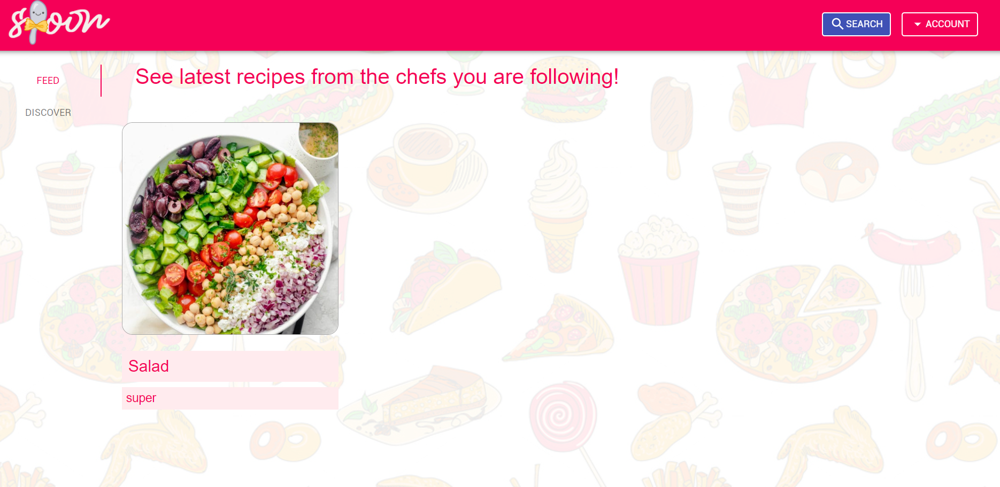
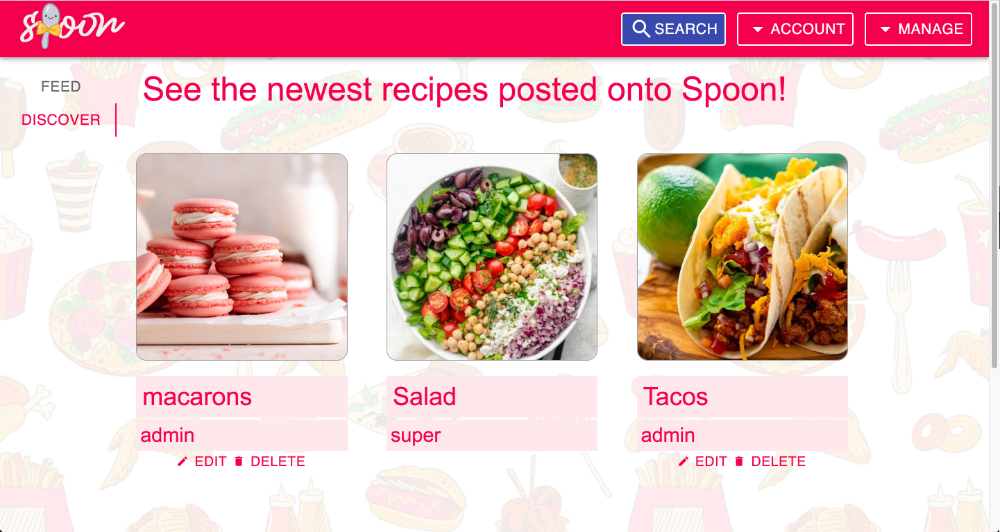
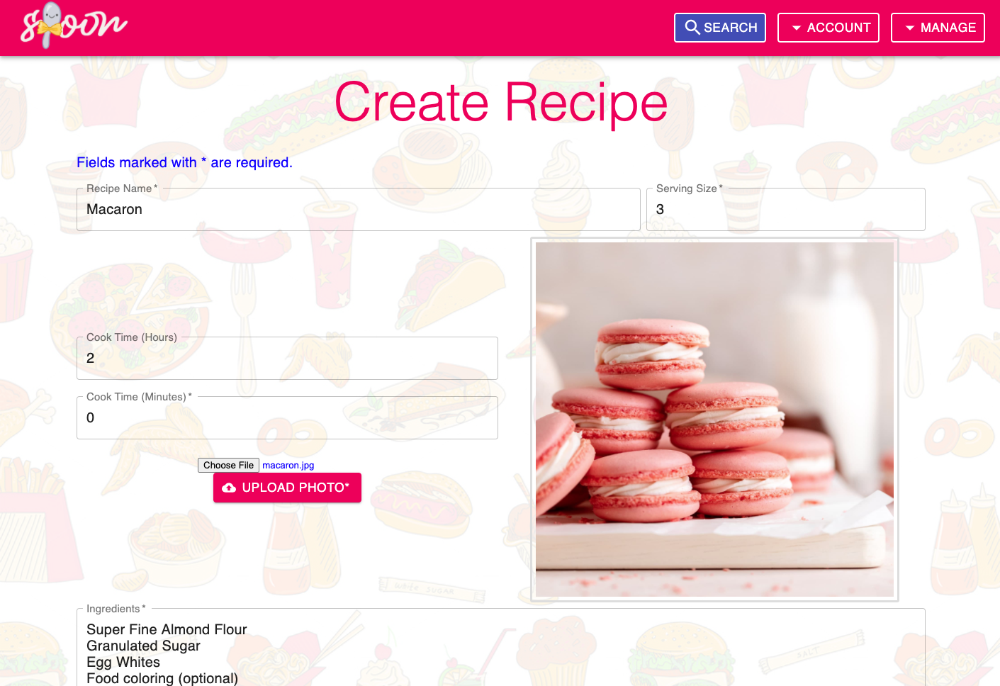
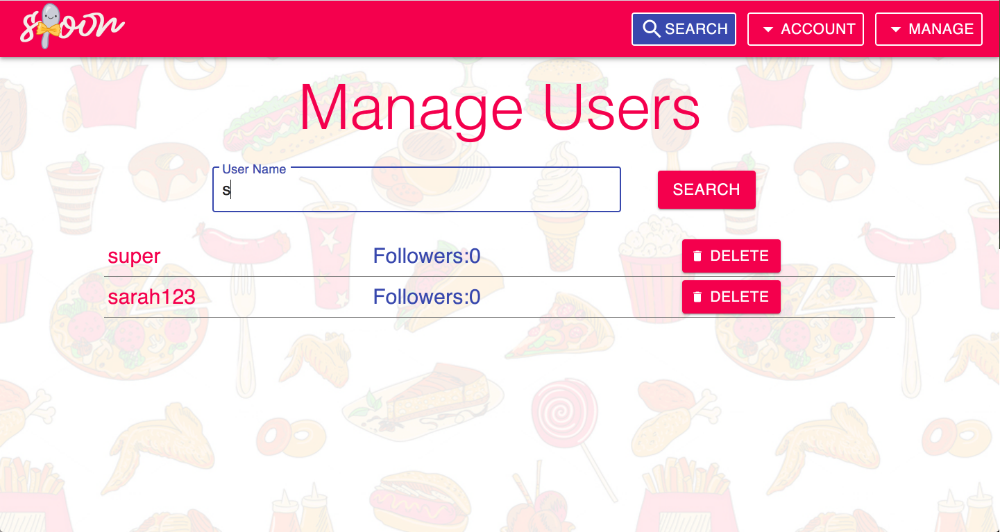
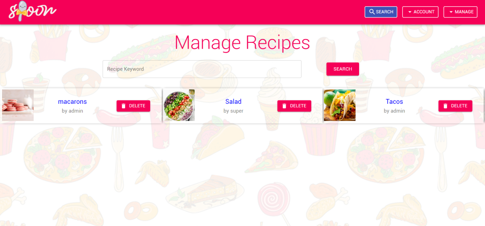
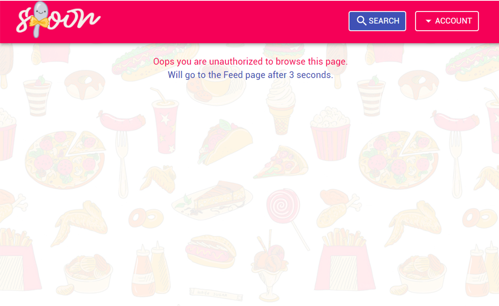
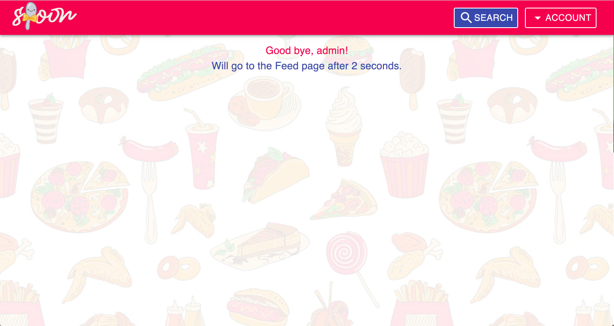

# Spoon: Recipe Site

Welcome to Spoon! A social media-esque web application where users can share and view recipes with others. 

***

## Demo

You can access the site [here](https://secure-mesa-87660.herokuapp.com/).

***

## Development

You can also run this locally by following the steps below.Start your local Mongo database. In a separate terminal window:

```
mkdir mongo-datamongod --dbpath
mongo-data
```

In the root directory of the repo, run:

```
npm install
cd client
npm install
npm run build
cd ..
npm start
```

The site will be on http://localhost:5000/.

***

## Login Credentials

Users can create their own account, or preview the website as a guest. There are a few pre-existing accounts with login info that you can experiment with:

| Username | Password |
| -------- | -------- |
| admin    | admin    |
| user1    | user1    |
| user2    | user2    |

***

## User Functionality
There are 3 types of users: ‘guest’, ‘user’, and ‘admin’. A ‘guest’ is a user that is not signed in. A ‘user’ and an ‘admin’ are both users that are signed in. An  ‘admin’ user has more access than a ‘user’ user does. 

A Thumbnail for a recipe has 3 parts. An image of the recipe, the name of the recipe, and the username of the user who has posted it. Hovering over the image will show the number of likes the recipe has. Clicking on the image will bring up a recipe pop-up and clicking on the username will send the user to the user profile of the user who created the recipe.

More details about functionality below.

### 'Guest'
- **Discover**: When a user visits the site as a guest, they are directed to the Feed page, which, as a guest, only consists of the Discover tab. This tab will display Thumbnails for every recipe stored in the database. A guest will not be able to like a recipe, unlike a user or admin.

- **Search**: On the right side of the header, there is a Search button. Clicking this will bring the user to the Search page. On this page, a user can search for recipes or users. For recipes, all recipe Thumbnails will be shown by default. Then the user can type in the search bar, adjust the time it takes to make the recipe, and check/uncheck different tags depending on what they are looking for. The recipes shown will update automatically. For users, the user will need to type something into the Search bar and press Search for results to come up. All users with matching usernames will appear. After doing a search, the user can click on the recipe Thumbnail image to see a recipe pop-up, or click on a user's username to see a user's profile.

- **View Recipes**: When a user clicks on the image of a recipe Thumbnail, a recipe pop-up will appear. This pop-up contains more detailed information about the recipe, such as its ingredients, instructions, tags, and more. While on the pop-up the only thing the user can do is exit it.

  

- **View User Profiles**: When a guest user clicks on the username displayed on a recipe Thumbnail, they are sent to the user's profile page. The profile page will have the user's username, their number of followers, and 2 tabs that show recipe Thumbnails. The first tab is Recipes. This tab will show all of the recipes that the user has posted. The second tab is Likes. This tab will show all of the recipes that the user has liked. 

- **Create an Account**: A guest user may create an account by going to the header, clicking Account, and the Sign Up. They will be redirected to an Account Creation page where they will need to input a username, password, and a password confirmation. When they click Sign Up, their account will be created, and they will be redirected to the Feed page as a signed in user.

- **Sign In**: If a guest user already has an account, they can sign in by going to the header, clicking Account, and then Sign In. They will be redirected to a Sign In page where they will need to enter their username and password. When they click Sign In (with valid credentials), they will be sent to the Feed page as a signed in user.

### 'User'
'Guest' functionalities are mostly a subset of 'user' functionalities. A 'user' will not be able to create an account or sign in (they may if they log out). A guest cannot like recipes while a 'user' can. Other differences, along with the additional functionalities, are described below.

- **Feed**: When a 'user' logs in, they will be directed to the Feed page, which will have 2 tabs, the Feed tab, and the Discover tab. The Feed tab will display Thumbnails for the last 9 recipes that the user's they follow have posted (latest to oldest).

  

- **Discover**: Same functionality as a guest except that the Discover tab is one of 2 tabs on the Feed page.

  

- **Search**: Same functionality as a guest.

- **View Recipes**: Same functionality as a guest except that the user can also like other users' recipes.

- **View User Profiles**: Same functionality as a guest (when viewing other user's profiles) except that there will be a follow button on the user profile page. If the logged-in user is already following the user whose profile they are viewing, the button will be grey and say 'UNFOLLOW'. Otherwise it will be pink and say 'FOLLOW'.

    The user can access their own profile easily by going to the header and clicking Account then My Profile. On their own profile page, there will not be a follow button.

- **Create Recipes**: A 'user' can create a recipe by going to the header and clicking Account then Create Recipe. They will be sent to a Recipe Creation page where they will need to fill out all the fields and upload a photo for their recipe. After clicking Add Recipe, their recipe will be added and they will be able to see this newly added recipe by going to their profile.

  

- **Edit and Delete Own Recipes**: Under any Thumbnail which is the user's own recipe, there will be Edit and Delete buttons. These allow the user to edit and delete their own recipes. When the user clicks edit, a pop-up will appear which allows the user to edit all the fields of the recipe. After making the changes, the user can press Save Edits and then they will need to refresh the page to see the edits. For the delete button, the user just needs to click it to delete the recipe. In this case, they will also need to refresh the page in order to see their changes.

- **Log Out**: A 'user' can log out of their account by going to the header and clicking Account then Log Out. They will be redirected to the guest Feed page after a few seconds.

### 'Admin'
'User' functionalities are a subset of 'admin' functionalities. Additional functionalities are described below.

- **Feed**: Same functionality as a 'user'.

- **Discover**: Same functionality as a 'user'.

- **Search**: Same functionality as a 'user'.

- **View Recipes**: Same functionality as a 'user'.

- **View User Profiles**: Same functionality as a 'user'.

- **Create Recipes**: Same functionality as a 'user'.

- **Edit and Delete Own Recipes**: Same functionality as a 'user'.

- **Manage Users**: An admin can manage users by going to the header and clicking on Manage then Users. On the Manage Users page, there is a search bar along with a list of users. The admin can filter users by name by typing into the search bar. They will be able to see usernames, number of followers, and a delete button. They can click on a user's username to go to the user's profile and they can delete a user by clicking the Delete button.
When the Manager deletes a user, all the recipes created by this user will also be deleted. And this user will be removed from users who followed him. The deleted recipes will also be removed from the corresponding user's feed page and liked page.

  

- **Manage Recipes**: An admin can manage users by going to the header and clicking on Manage then Recipes. On the Manage Recipes page, there is a search bar along with a list of recipes (not Thumbnails). The admin can filter recipes by name by typing into the search bar. They will be able to see the recipe's image, the recipe name, the username of its creator, and a delete button. They can click on the recipe image to bring up the recipe pop-up and they can delete a recipe by clicking the Delete button. The deleted recipe will also be removed from its owner's recipes list, the corresponding user's feed page and liked page.

  

- **Log Out**: Same functionality as a 'user'.

***

## Other Features

- Unauthorized page (a non-admin user tries to access /ManageRecipes or /ManageUsers).


- When the user logs out, they see this page and will be redirected to the Feed after a few seconds. There is a similar feature when the user signs in.


***

## Routes

***

### Session

- `USE`: Create a session and session cookie.
- `POST /users/login`:  Login and create a session.
    
    Expects login info:
    ```
    {
        "username": <username>,
        "password": <password>
    }
    ```
    Returns info for logged in user:
    ```
    {
        "username": <username>,
        "userMode": <userMode>,
        "userId": <userId>
    }
    ```
- `GET /users/logout`: Logout destroy the session.

    Returns username of logged out user:
    ```
    {
        "username": <username>
    }
    ```
- `GET /users/check-session`: Checks whether or not a user is logged into a session.

    If logged in, returns info for logged in user:
    ```
    {
        "username": <username>,
        "userMode": <userMode>,
        "userId": <userId>
    }
    ```
    If not logged in, returns guest info:
    ```
    {
        "username": "",
        "userMode": "guest",
        "userId": ""
    }

### Users

- `GET /api/users/currentUser`: Gets the user that is currently logged in.

  Returns the user document :
  ```
  {
    "_id": <ObjectId>
    "username": <username>,
    "password": <password>,
    "isAdmin": <boolean>,
    "followers": <list of user ids>,
    "following": <list of user ids>,
    "recipes": <list of recipe ids>,
    "liked": <list of recipe ids>,
    "feed": <list of recipe ids>,
    "__v": <Number>
  }
  ```

- `POST /api/users`: Creates a new user.

  Expects user info:
  ```
  {
    "username": <username>,
    "password": <password>,
    "isAdmin": <boolean>
  }
  ```
  Returns the new user document:
  ```
  {
    "_id": <ObjectId>
    "username": <username>,
    "password": <password>,
    "isAdmin": <boolean>,
    "followers": <list of user ids>,
    "following": <list of user ids>,
    "recipes": <list of recipe ids>,
    "liked": <list of recipe ids>,
    "feed": <list of recipe ids>,
    "__v": <Number> 
  }
  ```

- `DELETE /api/users/:id`: Deletes the user with id `id`.
If this route is used directly in Postman, you need to also manually update other users and recipes so that the user and their recipes are deleted everything. 

  Returns the deleted user document:
  ```
  {
    "_id": <ObjectId>
    "username": <username>,
    "password": <password>,
    "isAdmin": <boolean>,
    "followers": <list of user ids>,
    "following": <list of user ids>,
    "recipes": <list of recipe ids>,
    "liked": <list of recipe ids>,
    "feed": <list of recipe ids>,
    "__v": <Number> 
  }
  ```

- `PATCH /api/users:id`: Modifies an existing user.

  Expects array of changes: for example,
  ```
  [
    { "path": "/followers", "value": ["user1", "user2"] },
    { "path": "/liked", "value": [recipe1Id, recipe2Id, recipe3Id]}
    ...
  ]
  ```
  Returns the modified user document:
  ```
  {
    "_id": <ObjectId>
    "username": <username>,
    "password": <password>,
    "isAdmin": <boolean>,
    "followers": <list of user ids>,
    "following": <list of user ids>,
    "recipes": <list of recipe ids>,
    "liked": <list of recipe ids>,
    "feed": <list of recipe ids>,
    "__v": <Number> 
  }
  ```

- `GET /api/users`: Gets all the users.

  Returns all users:
  ```
  {
      "users": <list of user documents>
  }
  ```

- `GET /api/users/:id`: Gets a specific user in the database with id `id`.

  Returns the specified user document:
  ```
  {
    "_id": <ObjectId>
    "username": <username>,
    "password": <password>,
    "isAdmin": <boolean>,
    "followers": <list of user ids>,
    "following": <list of user ids>,
    "recipes": <list of recipe ids>,
    "liked": <list of recipe ids>,
    "feed": <list of recipe ids>,
    "__v": <Number> 
  }

### Images

- `POST /api/images`: Adds the imageSchema to our Cloudinary server.

- `DELETE /api/images/:id`: Deletes the image with id `id` from the Cloudinary server.

### Recipes

- `POST /api/recipes`: Creates a new recipe.
  If this route is used directly in Postman, you need to also manually update the user's recipe list. 

  Expects new recipe info:
  ```
  {
    "_id": <ObjectId>,
    "recipeName": <recipe name>,
    "owner": <owner>,
    "ingredients": <list of ingredients>,
    "instructions": <list of instructions>,
    "servingSize": <serving size>,
    "cookTimeHrs": <cook time in hours>,
    "cookTimeMins": <cook time in minutes,
    "tags": <list of tags>,
    "recipePhoto": <ImageSchema>,
    "likes": <likes>,
    "__v": <Number>
  }
  ```
  Returns the new recipe document:
  ```
  {
    "_id": <ObjectId>,
    "recipeName": <recipe name>,
    "owner": <owner>,
    "ingredients": <list of ingredients>,
    "instructions": <list of instructions>,
    "servingSize": <serving size>,
    "cookTimeHrs": <cook time in hours>,
    "cookTimeMins": <cook time in minutes,
    "tags": <list of tags>,
    "recipePhoto": <ImageSchema>,
    "likes": <likes>,
    "__v": <Number>
  }
  ```

- `DELETE /api/recipes/:id`: Deletes the recipe with id `id`.
  If this route is used directly in Postman, you need to also manually update the user's recipe list. 

  Returns the deleted recipe document:
  ```
  {
    "_id": <ObjectId>,
    "recipeName": <recipe name>,
    "owner": <owner>,
    "ingredients": <list of ingredients>,
    "instructions": <list of instructions>,
    "servingSize": <serving size>,
    "cookTimeHrs": <cook time in hours>,
    "cookTimeMins": <cook time in minutes,
    "tags": <list of tags>,
    "recipePhoto": <ImageSchema>,
    "likes": <likes>,
    "__v": <Number>
  }
  ```

- `PATCH /api/recipe/:id`: Modifies an existing recipe.

  Expects array of changes: for example,
  ```
  [
    { "path": "/recipeName", "value": <new recipe name> },
    { "path": "/servingSize", "value": <new serving size> },
    ...
  ]
  ```

  Returns the modified recipe document:
  ```
  {
    "_id": <ObjectId>,
    "recipeName": <recipe name>,
    "owner": <owner>,
    "ingredients": <list of ingredients>,
    "instructions": <list of instructions>,
    "servingSize": <serving size>,
    "cookTimeHrs": <cook time in hours>,
    "cookTimeMins": <cook time in minutes,
    "tags": <list of tags>,
    "recipePhoto": <ImageSchema>,
    "likes": <likes>,
    "__v": <Number>
  }

  - Returns JSON of the database document updated

- `GET /api/recipes`: Gets all the recipes.

  Returns all recipes:
  ```
  {
      "recipes": <list of user documents>
  }
  ```

- `GET /api/recipes/:id`: Gets a specific recipe in the database with id `id`.

  Returns the specified recipe document:
  ```
  {
    "_id": <ObjectId>,
    "recipeName": <recipe name>,
    "owner": <owner>,
    "ingredients": <list of ingredients>,
    "instructions": <list of instructions>,
    "servingSize": <serving size>,
    "cookTimeHrs": <cook time in hours>,
    "cookTimeMins": <cook time in minutes,
    "tags": <list of tags>,
    "recipePhoto": <ImageSchema>,
    "likes": <likes>,
    "__v": <Number>
  }

***

## Third-Party Libraries

- Material-UI/core
- Material-UI/icons
- Material-UI/lab
- React-uid
- ESLint
